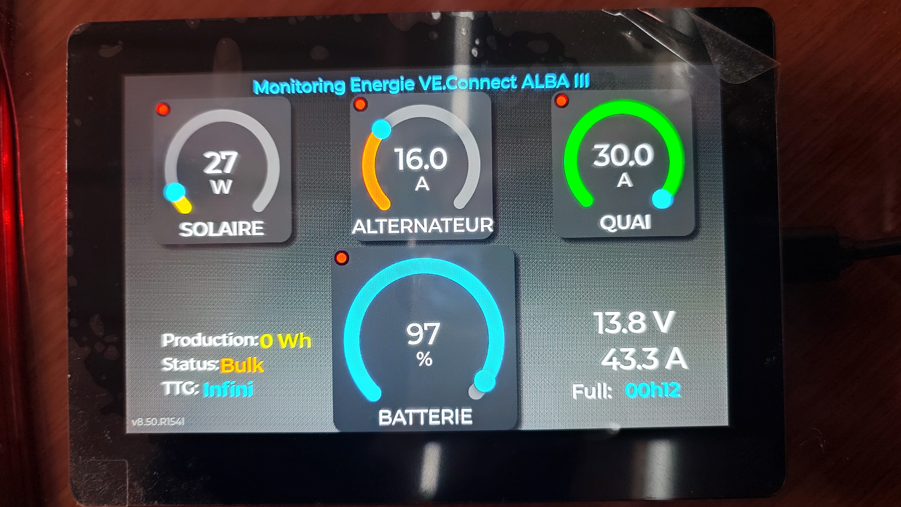

# Victron-Energy-Monitor-WaveShare
A Waveshare ESP32 S3 touch LCD 5B turned into a monitor screen for Victron devices (BMV712, Orion XS50, IP22, SmartSolar)

For the English version, please read the file ReadMe_EN.md

Ce projet permet d’utiliser une carte Waveshare ESP32 S3 Touch LCD 5B comme répéteur de plusieurs appareils Victron par liaison BlueTooth.
J’avais envie de regrouper sur un seul écran les données principales des quatre appareils Victron du bord :
-	BMV 712
-	Orion XS 50
-	Smart Solar 100/30
-	Chargeur IP22 12/30
  
Je trouve cela plus pratique que les petits afficheurs ronds Victron et je n’ai pas toujours envie d’avoir mon téléphone à la main, surtout en navigation pour consulter l’App Victron Connect, même si elle est très aboutie.
 

LA CARTE WAVESHARE :
C’est une carte « All-In-One ». Ses avantages c’est qu’elle est plus grande que les afficheurs Victron : 5 pouces 1024*600, tactile, facile à brancher car elle a une entré pour l’alimentation de 7-36V et elle communique en Bluetooth avec les appareils Victron. Elle possède une  I/O CAN potentiellement interfaçable avec le réseau NMEA2000 du bord. Son prix est raisonnable, moins de 50€.
En savoir plus : https://www.waveshare.com/esp32-s3-touch-lcd-5.htm

LOGICIEL :
Le code a été développé avec l’IDE Arduino 2.3.6 avec l’aide d’Antropic Claude Sonnet Opus 4.5 Pro.
C’est du code C++ et LVGL ( https://lvgl.io/ )
Dépendances : Bibliothèques
-	LVGL 8.4.0
-	ESP32_Display_Panel 1.04
-	ESP32_IO_Expander 1.1.1
-	Esp-lib-utils 0.3.0

Paramétrage LVGL : Le fichier de paramétrage de LVGL « lv_conf.h » doit avoir été correctement paramétré par rapport à la carte utilisée. S’en assurer en testant les programmes « examples » de la library LVGL.
Dans ce fichier, ne pas oublier de sélectionner les polices de caractères utilisées par le projet (Paragraphe « Font usage »), Sélectionner également les paramètres suivants en particulier pour obtenir des couleurs en dégradées pour le fond d’écran.

PERSONNALISATION :
Des éléments doivent être impérativement personnalisés dans le code (Chapitre : « Personnalisation » sans le code) en fonction du bateau, de la batterie de servitude, et surtout des caractéristiques des appareils Victron :
-	Dans le fichier principal WS_IA_V8.XX_RXXX.INO :

Le nom du bateau qui sera affiché sur l'écran de splash et la ligne d'entête de l'écran principal.
<pre>
const char *NOM_BATEAU = "ALBA III"; 
</pre>

-	Dans le fichier acquisition_BT.cpp :

o	Capacité du parc de batteries gérée par le BMV712 (A)
o	Puissance du panneau solaire (Watt)
o	Puissance alternateur (A)
o	Puissance chargeur de quai (A)

<pre>
// Caractéristiques des appareils Victron
int CAPACITE_BATTERIE_AH = 280;  // Capacité batterie (Ah) pour calculs TTG
int PSOL = 350;   // Puissance max panneau solaire (Watt)
int PALT = 50;    // Puissance max alternateur (Ampère)
int PQUAI = 30;   // Puissance max chargeur de quai (Ampère)
</pre>

o	Adresse MAC de chaque appareil Victron. Attention: Minuscules/majuscules peuvent avoir une importance.
<pre>
// Adresses MAC des appareils Victron
#define MAC_SMARTSOLAR "f3:81:dc:56:9f:97"
#define MAC_BMV_712 "c5:1d:ac:ed:91:92"
#define MAC_ORION_XS "fb:c1:a3:08:4e:8c"
#define MAC_IP22 "fb:82:24:5d:bb:27"
</pre>

o	Clé de cryptage de chaque appareil Victron.
<pre>
// Clés de décryptage
uint8_t key_SmartSolar[16] = {
  0x4B, 0x05, 0x18, 0xE7, 0x42, 0x76, 0x88, 0x3A, 0xAE, 0x6F, 0x1C, 0xC9, 0xB0, 0x84, 0x25, 0x06
};

uint8_t key_BMV[16] = {
  0xB4, 0x26, 0xA6, 0x45, 0x33, 0xFA, 0xD9, 0x63, 0x66, 0xAB, 0x72, 0xD3, 0x30, 0xAC, 0x13, 0x5A
};

uint8_t key_OrionXS[16] = {
  0xEC, 0x7E, 0x29, 0xE7, 0x60, 0x43, 0xB4, 0x91, 0x07, 0xB6, 0x01, 0x33, 0x06, 0xBB, 0xD0, 0x13
};

uint8_t key_IP22[16] = {
  0x64, 0xEB, 0xC5, 0x9D, 0xA0, 0xA1, 0x80, 0xB5, 0x9A, 0xE7, 0x44, 0xCF, 0x2B, 0xB4, 0xFF, 0x8B
};
</pre>

L’adresse MAC 
et la clé de cryptage de chaque appareil doivent être obtenue grâce à l’application VictronConnect disponible pour Android ou IOS. Dans l’application, pour chaque appareil, cliquer sur l’icône engrenage /  Menu 3 points / Infos produit /  Vérifier que le Bluetooth est activer  (Ne JAMAIS désactiver le Bluetooth, cela peut être irréversible). En bas de l’écran cliquez sur Données de Cryptage, sur l’écran suivant noter l’adresse MAC et la clé de cryptage. 
Ces deux informations devront être reportées dans le code source avec le format requis, par exemple :
-	6 octets de l’adresse MAC : f3 :81… (lettres en minuscules)
-	16 octets de la clé de cryptage : 0x4B, 0x05…( Lettres en majuscules)
Avertissement : La clé de cryptage d’un appareil Victron change si vous changez son code PIN. Si vous changez donc le code PIN d’un de vos appareils pour sécuriser son accès Bluetooth vous devrez obligatoirement modifier la clé de cryptage dans le code et le recompiler, sinon la carte Waveshare ne reconnaitra pas cet appareil.

Facultatif: Le nom en clair des appareils, sert à avoir des messages de debug plus clairs.
    <pre>
// Noms des appareils
#define NAME_SMARTSOLAR "SmartSolar"
#define NAME_BMV_712 "BMV-712"
#define NAME_ORION_XS "Orion XS"
#define NAME_IP22 "IP22"
</pre>

IMAGES :
Les images de l’écran de splash ont été générées par Microsoft Copilot en « .PNG » et transformées en « .c » par le convertisseur LVGL.
https://lvgl.io/tools/imageconverter
-	Paramètres de conversion :
o	LVGL V8
o	Format : CF_TRUE_COLOR
o	C array
o	Dither images
L’image de fond d’écran du splash est 3 fois plus petite que l’écran, 341*200 au lieu de 1024*600. LVGL la zoome 3 fois pour que l’affichage soit plein écran. Le petit logo Victron est affiché à sa taille native.

REMARQUES SUR LE FONCTIONNEMENT :
-	Le rafraichissement des données est d’environ toutes les 1.5 seconde. Remarque: lors des tests j'ai remarqué que l'IP22 semble avoir une émission bluetooth moins puissante que les autres appareils. Aussi il peut arriver que le signal soit dégradé et que l'on manque des paquest ce qui se traduit par un rafraichissement plus espacé. Ce problème disparait si on rapproche l'ESP32 de l'IP22.
-	Le point rouge dans le coin de chaque jauge indique la réception de nouvelles données. Si l’appareil n’émet plus après 15s le voyant s’éteint (1mn pour l’IP22)
-	La production affichée en bas à gauche est la production journalière. Cette donnée est issue du Smart Solar
-	Le Status est le status détecté par le Smart Solar (Bulk, Absoption..)
-	Le TTG (Time To Go) est la durée estimée de l’autonomie de la batterie. Si Production > Consommation le TTG devient « Infini »
-	Les Ampères affichés en bas à droite sont issus du BMV712, c’est donc le bilan de ce qui est consommé et ce qui est produit. Si l’ampérage devient négatif (Consommation > Production) l’affichage de la valeur devient orange
-	Full indique dans combien de temps la batterie sera pleine en fonction de la production et de la consommation. Si Consommation > Production alors Full affiche «---«
-	Mode veille: Toucher l'écran permet de passer en mode veille, c'est à dire éclairage atténué. Ce n'est pas vraiment un réglage de la luminosité, que je n'ai pas trouvé pour cette carte. J'ai triché en superposant un écran noir avec 80% d'opacité. Pour revenir en mode normal il faut toucher à nouveau l'écran. Il faut insister parfois quand ce n'est ps immédiat. C'est le gros défaut, car les test avec une réception BLE en continue ou avec FreeRtos et des mutex n'a pas donné de bons résultats en matière de réception, même si ça rendait le "touch" plus réactif.

